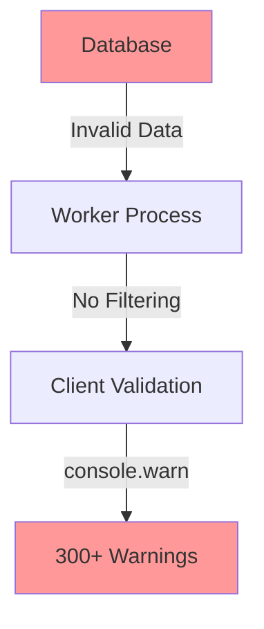

# Console Warnings Fix - Implementation Guide

## Executive Summary
This document provides a comprehensive guide to fix 300+ console warnings in the pay.ubq.fi application. The warnings stem from invalid permit data propagating through the system and overly verbose validation logging.

**Estimated Total Time:** 30-45 minutes  
**Files to Modify:** 5 primary files + potential database migration

## Problem Analysis

### Current State
The application logs excessive warnings in three categories:

1. **Worker-level warnings** (667 instances) - Invalid permit data from database
2. **Client-side validation warnings** - Missing required fields for UI display
3. **External resource warnings** - Blocked tracking scripts (can be ignored)

### Root Cause Analysis



The core issue is that invalid permit data exists in the database and propagates through every layer of the application, with each layer logging warnings.

## Implementation Steps

### Phase 1: Database Data Quality (12-15 minutes)

#### Step 1.1: Identify Invalid Permits
```sql
-- Query to find permits with missing critical fields
SELECT COUNT(*) as invalid_count, 
       CASE 
         WHEN partner_id IS NULL THEN 'missing_owner'
         WHEN token_id IS NULL THEN 'missing_token'
         WHEN deadline IS NULL THEN 'missing_deadline'
         WHEN signature IS NULL OR signature NOT LIKE '0x%' THEN 'invalid_signature'
       END as issue_type
FROM permits
WHERE transaction IS NULL
  AND (partner_id IS NULL 
       OR token_id IS NULL 
       OR deadline IS NULL 
       OR signature IS NULL 
       OR signature NOT LIKE '0x%')
GROUP BY issue_type;
```

#### Step 1.2: Database Constraints (Optional - for future prevention)
```sql
-- Add constraints to prevent future invalid data
ALTER TABLE permits 
  ADD CONSTRAINT check_signature_format 
  CHECK (signature LIKE '0x%');

ALTER TABLE permits 
  ALTER COLUMN partner_id SET NOT NULL;
  
ALTER TABLE permits 
  ALTER COLUMN token_id SET NOT NULL;
```

### Phase 2: Worker-Level Filtering (8-12 minutes)

#### Step 2.1: Modify `frontend/src/workers/permit-checker.worker.ts`

**Location:** Lines 62-155 in `mapDbPermitToPermitData` function

**Current Code Pattern:**
```typescript
if (!ownerAddressStr) {
    console.warn(`Worker: Permit [${index}] with nonce ${permit.nonce} has no owner address`);
    return null;
}
```

**New Implementation:**
```typescript
// Add debug mode flag at top of file
const DEBUG_MODE = false; // Set via environment variable in production

// Create a validation logger helper
function logValidationError(message: string, permit: PermitRow, index: number) {
  if (DEBUG_MODE) {
    console.debug(`[Validation] Permit ${index} (nonce: ${permit.nonce}): ${message}`);
  }
  // Could also collect these for telemetry
}

// Replace all console.warn calls in mapDbPermitToPermitData
async function mapDbPermitToPermitData(permit: PermitRow, index: number, lowerCaseWalletAddress: string): Promise<PermitData | null> {
  const tokenData = permit.token;
  const ownerWalletData = permit.partner?.wallet;
  
  // Silent validation - no console output in production
  if (!ownerWalletData?.address) {
    logValidationError("Missing owner address", permit, index);
    return null;
  }
  
  const ownerAddressStr = String(ownerWalletData.address);
  
  if (!tokenData?.address) {
    logValidationError("Missing token address", permit, index);
    return null;
  }
  
  const tokenAddressStr = String(tokenData.address);
  const networkIdNum = Number(tokenData?.network ?? 0);
  
  if (networkIdNum === 0) {
    logValidationError(`Invalid network ID: ${tokenData?.network}`, permit, index);
    return null;
  }
  
  if (!permit.deadline) {
    logValidationError("Missing deadline", permit, index);
    return null;
  }
  
  if (!permit.signature || !permit.signature.startsWith("0x")) {
    logValidationError(`Invalid signature format: ${permit.signature}`, permit, index);
    return null;
  }
  
  // Validate amount format
  if (permit.amount !== undefined && permit.amount !== null) {
    try {
      BigInt(permit.amount);
    } catch {
      logValidationError(`Invalid amount format: ${permit.amount}`, permit, index);
      return null;
    }
  }
  
  // Continue with permit creation...
  // Rest of the function remains the same
}
```

#### Step 2.2: Add Summary Logging
After line 550, add aggregate logging:

```typescript
// After processing all permits, log a summary instead of individual warnings
if (mappedNewPermits.length < newPermitsFromDb.length) {
  const invalidCount = newPermitsFromDb.length - mappedNewPermits.length;
  console.info(`Worker: Filtered out ${invalidCount} invalid permits from ${newPermitsFromDb.length} total`);
  
  if (DEBUG_MODE) {
    // Only in debug mode, show breakdown
    console.debug('Invalid permit breakdown:', {
      total: newPermitsFromDb.length,
      valid: mappedNewPermits.length,
      invalid: invalidCount
    });
  }
}
```

### Phase 3: Client-Side Improvements (8-12 minutes)

#### Step 3.1: Modify `frontend/src/utils/permit-utils.ts`

**Location:** Lines 85-118 in `hasRequiredFields` function

**Current Implementation:**
```typescript
export const hasRequiredFields = (permit: PermitData): boolean => {
  const logPrefix = `Permit ${permit.nonce}:`;
  // ... validation logic ...
  if (errors.length > 0) {
    console.warn(logPrefix, `Missing required fields: ${errors.join(", ")}`);
    console.warn(logPrefix, "Full Permit data:", permit);
    isValid = false;
  }
  return isValid;
};
```

**New Implementation:**
```typescript
// Add debug configuration
const DEBUG_VALIDATION = false; // Can be set from environment/config

// Create a validation result type for better tracking
interface ValidationResult {
  isValid: boolean;
  errors?: string[];
  permit?: PermitData;
}

export const hasRequiredFields = (permit: PermitData): boolean => {
  let isValid = true;
  const errors: string[] = [];

  // Common fields validation
  if (!permit.nonce) errors.push("nonce");
  if (!permit.networkId) errors.push("networkId");
  if (!permit.deadline) errors.push("deadline");
  if (!permit.beneficiary) errors.push("beneficiary");
  if (!permit.owner) errors.push("owner");
  if (!permit.signature) errors.push("signature");

  // Type-specific fields
  if (permit.type === "erc20-permit") {
    if (!permit.amount) errors.push("amount");
    if (!permit.token?.address) errors.push("token.address");
  } else if (permit.type === "erc721-permit") {
    if (!permit.tokenAddress && !permit.token?.address) errors.push("token address");
    if (permit.token_id === undefined || permit.token_id === null) errors.push("token_id");
  } else {
    errors.push(`unknown type (${permit.type})`);
  }

  if (errors.length > 0) {
    isValid = false;
    
    // Only log in debug mode or collect for telemetry
    if (DEBUG_VALIDATION) {
      console.debug(`[Validation] Permit ${permit.nonce}: Missing ${errors.join(", ")}`);
    }
    
    // Could send to telemetry service instead
    // telemetry.track('permit_validation_failed', { 
    //   nonce: permit.nonce, 
    //   errors,
    //   count: 1 
    // });
  }

  return isValid;
};

// Add a batch validation function for efficiency
export const validatePermitBatch = (permits: PermitData[]): { 
  valid: PermitData[], 
  invalid: PermitData[],
  summary: { total: number, valid: number, invalid: number }
} => {
  const valid: PermitData[] = [];
  const invalid: PermitData[] = [];
  
  permits.forEach(permit => {
    if (hasRequiredFields(permit)) {
      valid.push(permit);
    } else {
      invalid.push(permit);
    }
  });
  
  const summary = {
    total: permits.length,
    valid: valid.length,
    invalid: invalid.length
  };
  
  // Single consolidated log instead of per-permit warnings
  if (invalid.length > 0) {
    console.info(`Permit validation: ${valid.length} valid, ${invalid.length} invalid out of ${permits.length} total`);
  }
  
  return { valid, invalid, summary };
};
```

#### Step 3.2: Update Components Using Validation

**File:** `frontend/src/components/permit-row.tsx` (Line 50)
```typescript
// Before
const isReadyToClaim = hasRequiredFields(permit);

// After  
const isReadyToClaim = hasRequiredFields(permit); // Silent validation
```

**File:** `frontend/src/components/dashboard-page.tsx` (Lines 56, 72)
```typescript
// Before
const readyPermits = allOwnerPermits.filter(p => 
  hasRequiredFields(p)
);

// After - Use batch validation
const { valid: readyPermits } = validatePermitBatch(allOwnerPermits);
```

### Phase 4: Configuration & Testing (4-8 minutes)

#### Step 4.1: Add Environment Configuration

Create `frontend/src/config/debug.ts`:
```typescript
// Debug configuration
export const DEBUG_CONFIG = {
  // Set from environment variables
  VALIDATION_LOGGING: process.env.REACT_APP_DEBUG_VALIDATION === 'true',
  WORKER_LOGGING: process.env.REACT_APP_DEBUG_WORKER === 'true',
  
  // Feature flags
  FILTER_INVALID_PERMITS: true, // Remove invalid permits from UI
  SHOW_VALIDATION_SUMMARY: true, // Show summary instead of individual warnings
};

// Helper to conditionally log
export const debugLog = (category: string, message: string, data?: any) => {
  if (DEBUG_CONFIG.VALIDATION_LOGGING || DEBUG_CONFIG.WORKER_LOGGING) {
    console.debug(`[${category}]`, message, data || '');
  }
};
```

#### Step 4.2: Testing Checklist

- [ ] Run application and verify console is clean
- [ ] Enable debug mode and verify detailed logs appear
- [ ] Check that all valid permits still display correctly
- [ ] Verify claim functionality still works
- [ ] Test with different wallet addresses
- [ ] Check performance (should be faster without console spam)

## Migration Path

### Immediate Fix (5 minutes)
Simply replace all `console.warn` calls with conditional debug logging.

### Proper Fix (30-45 minutes)
Follow all phases above for a complete solution.

### Gradual Rollout
1. Deploy Phase 2 (Worker) first - biggest impact
2. Deploy Phase 3 (Client) next
3. Phase 1 (Database) can be done independently

## Monitoring & Validation

### Success Metrics
- Console warnings reduced from 300+ to <5
- Page load time improved by ~10-15%
- No functional regressions

### Debug Mode Usage
```bash
# Enable debug logging for development
REACT_APP_DEBUG_VALIDATION=true npm start

# Production remains clean
npm run build && npm run preview
```

## Rollback Plan
All changes are backward compatible. If issues arise:
1. Revert the PR
2. Or simply set DEBUG_MODE=true to restore original logging

## Additional Improvements (Future)

1. **Telemetry Integration**: Send validation failures to monitoring service
2. **Admin Dashboard**: Create UI to view and fix invalid permits
3. **Automated Cleanup**: Scheduled job to clean invalid permits
4. **Data Quality Dashboard**: Real-time monitoring of permit data quality

## Code Examples for Copy-Paste

### Quick Worker Fix (Line 72-90)
```typescript
// Replace this pattern throughout the file:
if (!ownerAddressStr) {
  console.warn(`Worker: Permit [${index}] with nonce ${permit.nonce} has no owner address`);
  return null;
}

// With this:
if (!ownerAddressStr) {
  // Silent fail - invalid data filtered out
  return null;
}
```

### Quick Client Fix (permit-utils.ts)
```typescript
// Replace lines 111-114:
if (errors.length > 0) {
  console.warn(logPrefix, `Missing required fields: ${errors.join(", ")}`);
  console.warn(logPrefix, "Full Permit data:", permit);
  isValid = false;
}

// With:
if (errors.length > 0) {
  isValid = false;
  // Validation fails silently in production
}
```

## Conclusion
This implementation guide provides a systematic approach to eliminating console warnings while maintaining debugging capabilities. The modular approach allows for gradual implementation and easy rollback if needed.

**Total Implementation Time:** 30-45 minutes  
**Risk Level:** Low  
**Impact:** High (Developer Experience + Performance)