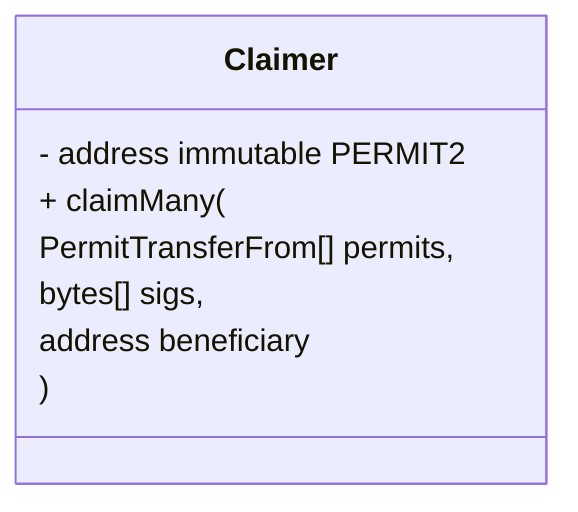
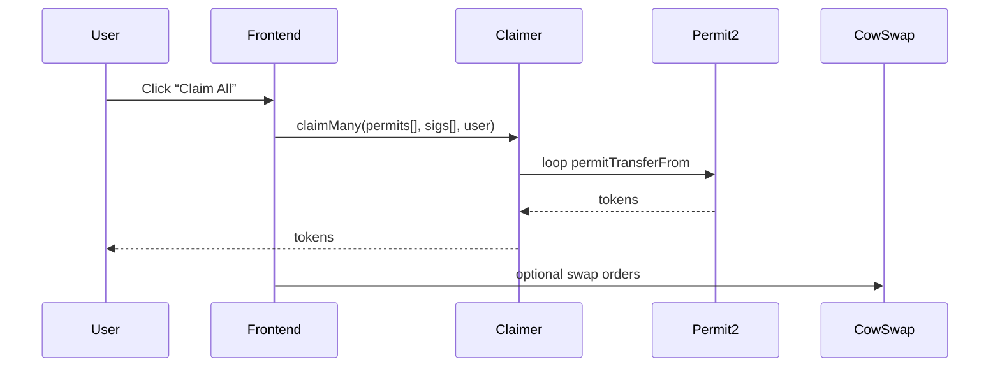

# Batch Claiming Roadmap – Permit Rewards  
*Author: Cline*  
*Date: 2025-05-18*

This document defines a staged strategy for eliminating the “one-permit, one-transaction” pain-point while remaining backwards-compatible with existing issued rewards.

---

## Quick Glossary
| Term | Meaning |
|------|---------|
| **Permit** | Existing *`PermitTransferFrom`* objects pasted by the GitHub bot. `spender = Permit2` |
| **Batch-permit** | EIP-712 *`PermitBatchTransferFrom`* covering multiple tokens in one signature |
| **Claimer** | A minimal on-chain helper contract that loops over many individual permits, then forwards all tokens to the beneficiary |
| **User queue** | Front-end code that auto-submits N consecutive `permitTransferFrom` tx in a single MetaMask prompt batch |

---

## Phase 1 — **Front-end User Queue**  (Immediate 💡)

### Goal  
Remove repetitive clicking without touching smart-contracts or GitHub bot.

### Implementation Steps
1. **Transaction Queue Utility**  
   * In `frontend/src/utils/permit-utils.ts` add `queuePermitClaims()` that:
     1. Filters *claimable* permits.
     2. Calls `writeContractAsync` on each with `mode: "recklesslyUnprepared"` to skip gas estimation (faster queue build).
     3. Uses `Promise.allSettled` to monitor receipts.
2. **Single “Claim All” button**  
   * In `use-permit-claiming.ts` expose `claimAllQueued()` that builds an array of prepared tx objects and passes them to **wallet batch APIs**:  
     * **Metamask:** `wallet_invokeSnap` → `metamask_sendDomainTransaction` (falls back to sequential `eth_sendTransaction` if unsupported).
     * **WalletConnect v2:** use `batchTransactions`.
3. **UI Feedback**  
   * Display:
     * Number queued
     * Pending / succeeded / failed counters
     * Running total tokens claimed
4. **Testing**  
   * Stub Wallet client and simulate 20 cheap test permits on a fork.  
   * Confirm: one MetaMask prompt with N tx lines → user clicks once → queue executes.

> 🔥 **Outcome:** works with **all historical permits**; user signs N tx but only approves once.

---

## Phase 2 — **Claimer.sol Helper Contract**  (Forward UX 🚀)

### Rationale  
Permits demand `msg.sender == spender`. By setting **Claimer** as `spender` at issuance time, *any* user can batch-claim via a **single** transaction.

### Design – `Claimer.sol`

* **Logic**
  1. `for` loop over permits:  
     `PERMIT2.permitTransferFrom(permit, {to: address(this), requestedAmount: permit.permitted.amount}, owner, sig);`
  2. After collecting, compute per-token totals.
  3. `safeTransfer` totals to `beneficiary`.
* **Gas**: O(N) internal calls but **one** outer tx.
* **Security**  
  * Re-entrancy guard.  
  * Accepts only permits where `spender == address(this)`.  
  * Emits `BatchClaimed(beneficiary, token[], amount[])`.

### Deployment
1. Write contract (Solidity 0.8.17; viaIR not required).  
2. Verify on relevant chains (Gnosis, Mainnet).  
3. Store address(es) in `frontend/src/constants/config.ts`.

### GitHub Reward-Bot Update
* When posting future rewards:
  * `spender = CLAIMER_ADDRESS`
  * Keep `PERMIT2` as target contract in signature.
* Optional: move to batch-permit format **instead** (see Phase 3).

### Front-end Flow

### Migration Note  
Old permits remain claimable via Phase 1 queue until expiry.

---

## Phase 3 — **Batch-Permit Issuance**  (Optional Future)

*Modify the bot to emit `PermitBatchTransferFrom` objects.*

Pros  
* Single signature from funder.  
* No on-chain loop (cheapest gas).

Cons  
* Requires new parsing & UI.  
* Not compatible with already-posted rewards.

---

## Phase 4 — **Gas Sponsorship & AA**  (Nice-to-Have)

1. **ERC-4337 paymaster** subsidises `claimMany` gas.  
2. **Relayer** can top-up UBIQ DAO treasury & reimburse.

---

## Timeline & Ownership

| Week | Deliverable | Owner |
|------|-------------|-------|
| 1 | Phase 1 live (queue, UI) | Front-end |
| 2 | Draft Claimer.sol, unit tests | Smart-contracts |
| 3 | Deploy Claimer on Gnosis & Mainnet staging | DevOps |
| 3 | Bot updated to use Claimer spender | GitHub-bot maintainer |
| 4 | Front-end detects new permits → uses Claimer path | Front-end |
| 5 | Deprecate queue for new rewards | Front-end |
| 6 | Feasibility study on paymaster / AA | Research |

---

## Risks & Mitigations
| Risk | Mitigation |
|------|------------|
| Claimer contract bug drains tokens | Extensive unit tests, Formal verification, 2-of-3 multisig for upgrade |
| Bot mis-configures spender address | CI lint on PR, on-chain test claim before comment post |
| Wallet batch API inconsistencies | Detect capability, fall back to sequential queue |
| Gas spike makes batch tx expensive | AA paymaster fallback |

---

## Action Items (to be opened as GitHub issues)

1. `frontend`: implement `queuePermitClaims` utility.  
2. `frontend`: add Claim All UI & progress component.  
3. `smart-contracts`: scaffold `contracts/Claimer.sol`.  
4. `devops`: script deployment + address export to `frontend`.  
5. `bot`: modify permit generator to set spender = Claimer.  
6. `docs`: keep this plan up-to-date in `/docs/progress.md`.

---

*End of document.*
