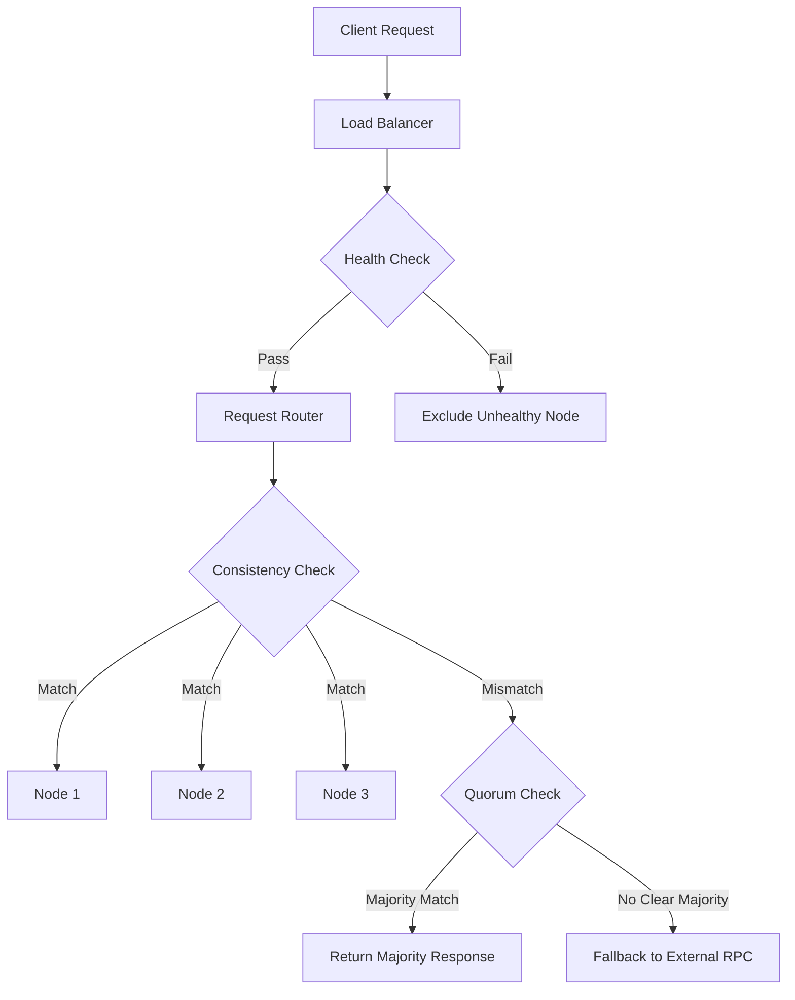

# RPC Provider Guide for Deterministic Contract Deployment

This document provides guidance on fixing issues with our RPC providers, particularly focusing on deterministic deployment of smart contracts across multiple chains.

## Issues with rpc.ubq.fi/100 Provider

Our internal rpc.ubq.fi/100 provider has been identified as returning different results compared to other Gnosis Chain RPC providers. This causes issues with deterministic contract deployment, verification, and other on-chain operations.

### Identified Problems

1. **Inconsistent chainstate data**: The rpc.ubq.fi/100 provider sometimes returns different bytecode for the same contract address compared to other RPC providers.

2. **Possible sync issues**: The node may be synced to a different checkpoint or fork of the Gnosis Chain.

3. **Potential caching problems**: Old or stale data might be cached, causing inconsistencies.

4. **Network routing inconsistencies**: As a gateway/relay service, network issues may cause requests to be routed to different backend nodes.

## Solution Approach

### Immediate Fix

1. **Modified Deployment Priority Order**

   We've updated our deployment scripts to use multiple RPC providers in a specific priority order:

   ```typescript
   const GNOSIS_CHAIN = {
     // ... other config
     rpcUrl: "https://rpc.gnosischain.com", // Primary
     fallbackRpcUrls: [
       "https://gnosis-mainnet.public.blastapi.io",
       "https://rpc.ankr.com/gnosis",
       // Our RPC is last since it's a relay to others
       "https://rpc.ubq.fi/100",
     ],
   };
   ```

2. **Automated RPC Fallback**

   Our new deployment script attempts connections to each RPC endpoint in order, only falling back to the next one if a connection fails:

   ```typescript
   // Try each RPC URL until one works
   while (currentRpcIndex < rpcUrls.length) {
     const currentRpc = rpcUrls[currentRpcIndex];
     try {
       // Test the connection
       await publicClient.getChainId();
       console.log(`✅ Successfully connected to ${currentRpc}`);
       break;
     } catch (err) {
       console.error(`❌ Failed to connect to RPC ${currentRpc}`);
       currentRpcIndex++;
     }
   }
   ```

3. **Robust Deployment Checks**

   The script performs multiple existence checks at both expected and known deployment addresses:

   ```typescript
   // Addresses to check in order
   const addressesToCheck = [
     { name: "Expected", address: expectedAddress },
     { name: "Known", address: KNOWN_DEPLOYED_ADDRESS }
   ];

   for (const addrInfo of addressesToCheck) {
     // Multiple attempts for each address
     for (let attempt = 0; attempt < 3; attempt++) {
       // Check code existence
     }
   }
   ```

### Long-term Fixes for rpc.ubq.fi/100

To permanently fix the issues with our RPC relay service, we recommend the following steps:

1. **RPC Node Infrastructure Improvements**

   - **Dedicated nodes**: Run dedicated Gnosis nodes rather than relying entirely on third-party services
   - **Redundancy architecture**: Multiple fully synced nodes behind a load balancer
   - **Health monitoring**: Implement health checks that verify blockchain state consistency
   - **Node diversity**: Use different client implementations to prevent client-specific bugs

2. **RPC Relay Service Enhancements**

   - **Connection validation**: Validate all nodes are on the same chain and at similar heights
   - **Response consistency**: Compare results from multiple backend nodes for critical operations
   - **Response caching improvements**: Implement smarter caching strategies with appropriate TTLs
   - **Circuit breakers**: Automatically remove inconsistent nodes from rotation

3. **Monitoring and Diagnostics**

   - **Real-time metrics**: Track latency, error rates, and node synchronization status
   - **Consistency checks**: Regular verification of blockchain state across all nodes
   - **Alerting**: Set up alerts for node desynchronization or performance degradation
   - **Regular auditing**: Scheduled comparisons against trusted public endpoints

## RPC Diagnostics Tool

We've developed a diagnostic tool (`scripts/rpc-diagnostics.ts`) that can help identify and troubleshoot issues with RPC providers:

```bash
# Run the diagnostics
bun scripts/rpc-diagnostics.ts
```

This tool performs the following tests across multiple RPC endpoints:

1. Basic connectivity and latency checks
2. Block number and hash comparison
3. Gas price consistency
4. Historical block existence and hash verification
5. Contract bytecode checks at specific addresses
6. Detailed analysis of rpc.ubq.fi/100 compared to other providers

Sample output:

```
🔍 COMPARISON BETWEEN RPC ENDPOINTS:

📊 Basic Connectivity:
+--------------------------+------------+------------+------------+
| Endpoint                 | Connected  | Chain ID   | Latency    |
+--------------------------+------------+------------+------------+
| https://rpc.gnosischain.com | ✅      | 100        | 245ms      |
| https://rpc.ubq.fi/100   | ✅         | 100        | 1230ms     |
+--------------------------+------------+------------+------------+

...

⚠️ INCONSISTENCY DETECTED: Different bytecode returned for these addresses:
- 0xfa3b31d5b9f91c78360d618b5d6e74cbe930e10e
```

### Running Diagnostics

Run this tool regularly to:
- Verify consistency across our RPC endpoints
- Detect early signs of node desynchronization
- Troubleshoot deployment issues
- Validate fixes to the RPC infrastructure

## Technical Implementation Details

### Load Balancing Architecture

For the rpc.ubq.fi service, we recommend implementing a smart load balancing solution:



### Health Check Implementation

Each node should be regularly checked with the following criteria:

1. **Basic connectivity**: Simple JSON-RPC calls succeed
2. **Chain ID verification**: Ensure the node is connected to the correct network
3. **Block height**: Verify the node is within a reasonable number of blocks from the network head
4. **Block hash consistency**: Compare block hashes at specific heights across nodes
5. **Response time**: Monitor for unusual latency spikes

### Configuration Example

```yaml
rpc_service:
  endpoints:
    - name: internal-node-1
      url: http://gnosis-node-1:8545
      priority: 1
      weight: 10
    - name: internal-node-2
      url: http://gnosis-node-2:8545
      priority: 1
      weight: 10
    - name: blastapi
      url: https://gnosis-mainnet.public.blastapi.io
      priority: 2
      weight: 5
    - name: ankr
      url: https://rpc.ankr.com/gnosis
      priority: 2
      weight: 5

  health_check:
    interval: 15s
    timeout: 5s
    checks:
      - type: chain_id
        expected: 100
      - type: block_height
        max_difference: 5
      - type: response_time
        max_ms: 500

  consistency:
    check_percentage: 10  # Check 10% of requests
    critical_methods:
      - eth_getCode
      - eth_getBlockByNumber
      - eth_getTransactionReceipt
```

## Deployment Strategy

For deterministic contract deployment across multiple chains, always follow these guidelines:

1. **Use CREATE2 for deterministic addresses**:
   The same contract bytecode deployed with the same salt using CREATE2 will always get the same address.

2. **RPC provider reliability**:
   Use multiple RPC providers in a failover configuration, preferring official or reliable providers first.

3. **Verification before deployment**:
   Always verify if a contract already exists at the expected address before attempting deployment.

4. **Consistent bytecode**:
   Ensure that compiler settings, solidity version, and optimizer settings are consistent across all deployments.

5. **Environment variables**:
   Use environment variables to control deployment behavior when needed:

   ```
   # Skip checking if contract exists at expected address
   SKIP_EXISTENCE_CHECK=true

   # Dry run to test without deploying
   --dry

   # Verify contract on etherscan
   --verify
   ```

## Conclusion

By implementing these recommendations, we can significantly improve the reliability of our RPC infrastructure and ensure consistent, deterministic deployments across all chains. The short-term solution in our deployment scripts provides immediate resilience against RPC inconsistencies, while the long-term infrastructure improvements will address the root causes.

For any deployment issues, first run the diagnostics tool to identify potential RPC inconsistencies, then use the improved deployment script with appropriate fallback providers.
