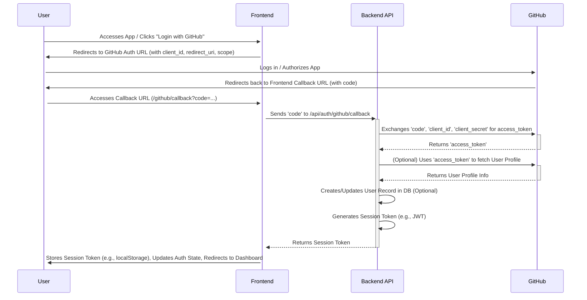

# GitHub Authentication Flow (Custom Backend)

This document details the OAuth 2.0 flow using GitHub for user authentication, implemented with a custom backend endpoint.

## 1. Overview

The application uses GitHub as an OAuth provider to authenticate users. The flow involves redirecting the user to GitHub, handling the callback, exchanging the temporary code for an access token via the backend, and establishing a session for the user.

## 2. Frontend Implementation (`frontend/src/App.tsx`, `frontend/src/auth-context.tsx`)

1.  **Initiate Login (`handleLogin` in `App.tsx`):**
    *   Construct the GitHub authorization URL (`GITHUB_AUTH_URL`).
    *   Include `client_id` (from environment variables, e.g., `import.meta.env.VITE_GITHUB_CLIENT_ID`).
    *   Include `redirect_uri` (pointing to the frontend callback route, e.g., `http://localhost:5173/github/callback`).
    *   Include necessary `scope` (e.g., `read:user`).
    *   Redirect the user's browser to this URL: `window.location.href = GITHUB_AUTH_URL;`.
2.  **Handle Callback (`GitHubCallback` component in `App.tsx`):**
    *   This component is mounted when GitHub redirects back to `/github/callback`.
    *   Use `useLocation` from `react-router-dom` to get the URL search parameters.
    *   Extract the `code` parameter provided by GitHub.
    *   If `code` exists:
        *   Send the `code` to the backend API endpoint (e.g., `POST /api/auth/github/callback`).
        *   Handle the response from the backend:
            *   On success: Receive the session token (e.g., JWT). Call the `login(token)` function from `AuthContext` to store the token and update the global auth state. Redirect the user to the main dashboard (`/`).
            *   On failure: Display an error message. Redirect the user back to the login page (`/`).
    *   If `error` parameter exists: Display an error message. Redirect the user back to the login page (`/`).
3.  **Authentication State (`auth-context.tsx`):**
    *   The `AuthProvider` manages the `isLoggedIn` state.
    *   The `login` function stores the received session token (e.g., in `localStorage`) and sets `isLoggedIn` to `true`.
    *   The `logout` function removes the token and sets `isLoggedIn` to `false`.
    *   An effect checks for the token on initial load to maintain the session across page refreshes.
4.  **Authenticated Routes (`App.tsx`):**
    *   Uses the `isLoggedIn` state from `useAuth` to conditionally render the `LoginPage` or the main `DashboardPage`.

## 3. Backend Implementation (`backend/api/main.ts` - Deno/Hono)

1.  **Callback Endpoint (`POST /api/auth/github/callback`):**
    *   Define a new route handler for this endpoint.
    *   Receive the `code` from the frontend request body.
    *   **Security:** Validate the request origin if necessary.
2.  **Exchange Code for Token:**
    *   Make a `POST` request to GitHub's token endpoint (`https://github.com/login/oauth/access_token`).
    *   Include `client_id` (from environment variables, e.g., `Deno.env.get("GITHUB_CLIENT_ID")`).
    *   Include `client_secret` (from environment variables, e.g., `Deno.env.get("GITHUB_CLIENT_SECRET")`). **Store this securely!**
    *   Include the received `code`.
    *   Set the `Accept: application/json` header.
    *   Parse the response from GitHub to get the `access_token`. Handle errors.
3.  **(Optional) Fetch User Profile:**
    *   Use the obtained `access_token` to make a request to the GitHub API user endpoint (`https://api.github.com/user`).
    *   Include the token in the `Authorization: Bearer <access_token>` header.
    *   Retrieve user details (ID, username, avatar URL, etc.).
4.  **(Optional) User Database:**
    *   Use the GitHub user ID or other unique identifier to find or create a user record in the application's database (Supabase). Store relevant profile information.
5.  **Generate Session Token:**
    *   Create a session token (e.g., a JWT) containing relevant user information (e.g., internal user ID, GitHub username, expiry).
    *   Sign the JWT using a secret key stored securely in environment variables (e.g., `Deno.env.get("JWT_SECRET")`).
6.  **Send Response:**
    *   Return the generated session token (JWT) to the frontend in the response body. Set appropriate HTTP status codes (200 on success, error codes on failure).

## 4. Configuration

*   **GitHub OAuth App:**
    *   Register an OAuth App on GitHub.
    *   Set the "Authorization callback URL" to the frontend callback route (e.g., `http://localhost:5173/github/callback` for local dev, production URL for deployment).
    *   Note the generated `Client ID` and `Client Secret`.
*   **Environment Variables:**
    *   **Frontend (e.g., `.env` for Vite):**
        *   `VITE_GITHUB_CLIENT_ID`: The Client ID from the GitHub OAuth App.
        *   `VITE_BACKEND_API_URL`: The base URL for the backend API (e.g., `http://localhost:8000`).
    *   **Backend (e.g., Deno Deploy secrets):**
        *   `GITHUB_CLIENT_ID`: The Client ID from the GitHub OAuth App.
        *   `GITHUB_CLIENT_SECRET`: The Client Secret from the GitHub OAuth App.
        *   `JWT_SECRET`: A strong, unique secret for signing session tokens.
        *   `SUPABASE_URL`, `SUPABASE_ANON_KEY` (if using Supabase DB).

## 5. Security Considerations

*   Store `GITHUB_CLIENT_SECRET` and `JWT_SECRET` securely on the backend; never expose them to the frontend.
*   Use HTTPS for all communication.
*   Validate the `state` parameter during the OAuth flow to prevent CSRF attacks (though not explicitly shown in the basic flow above, it's recommended).
*   Set appropriate expiry times for session tokens (JWTs).
*   Consider token refresh mechanisms if needed (GitHub access tokens typically don't expire unless revoked, but session JWTs should).
